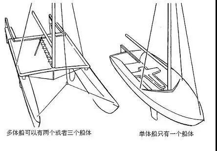

# 遥控双体帆船

## 单体帆船与双体帆船

帆船，顾名思义有捕捉风力的帆。只要风向与航向不重合（绝大多数情况都会有夹角，比如侧风航行、逆风航行），风对帆的作用力就同时有平行船身和垂直船身两个分力。平行船身的力就是推动船身前进的力。由于船身是细长的，向前平移阻力很小，而向左右平移阻力很大，所以垂直船身的分力很难让船侧移。但是，由于桅杆较高，受力中心较高，垂直船身的分力会产生较大的侧倾力矩，使船身倾斜。为了抵抗这个倾斜力矩，通常有两种方案，也就分化出两种船型：单体帆船与双体（多体）帆船。

单体帆船的底部有一块龙骨（也有叫稳向板、中心板），通常龙骨下端还有一块压铅。

压铅的作用就是，当帆船倾斜时，这块巨重的铅块会产生回正力矩，对抗帆的侧倾力矩。当侧倾角度θ从0增大到90的过程中，侧倾力矩从最大降到0（因为帆在竖直方向的投影面积是关于θ的余弦函数），而压铅的重力所产生的回正力矩从0增大到最大（因为压铅重力的力臂长度是关于θ的正弦函数），所以这两个力矩必然在某个角度上相等，从而平衡。于是单体帆船如同海上不倒翁，会倾斜，但不会翻。

双体帆船则有两个船体。当船体倾斜时，一侧吃水深、浮力大，一侧吃水浅、浮力小，这两侧浮力之差产生回正力矩。倾斜角越大，侧倾力矩越小，而回正力矩越大，所以也会在某个角度平衡。

但是存在一个例外情况：假设侧倾力矩足够大，以至于一侧船体完全离开水面，那么此时离开水面的一侧浮力为0，而留在水中的一侧浮力等于重力，同时，浮力的力臂长度是关于倾斜角的余弦函数，所以回正力矩也变成了关于倾斜角的余弦函数。此时，倾斜力矩和回正力矩都是余弦函数，那么没有交点了，船就没法平衡了，会侧翻。

## 双体帆船的优点以及缺点的克服方案

双体帆船通常更接近竖直状态，而单体帆船则更加倾斜，换言之，双体帆船的倾斜角通常比单体帆船小。这意味着，相同面积的帆，双体船的力效更高，推力越大。舵效也是同理。同时，双体帆船的甲板面积宽大，改装潜力更大。

但是，双体帆船的缺点就在于，一旦操作不当，或者突遇阵风，就可能因为倾斜角过大而侧翻，侧翻后还不会自动回正。有没有什么解决办法呢？

在真实的帆船上，水手可以凭借经验控制倾斜角在合理范围内，而且由于船体有巨大的转动惯量，即使突遇阵风也不会一下子侧翻，会有足够的反应时间。但是在遥控帆船上，一方面是玩家是远程控制，感知能力必然不及水手；另一方面，转动惯量很小，阵风影响很大，没有足够的反应时间。

于是我想到，既然人反应不过来，那就交给计算机呀！四轴飞行器有飞控计算机来实时调整姿态，那么双体帆船也可以有个“航控”计算机来实时调整姿态。比如当计算机检测到倾角过大时，就立即放松帆索，使得帆开角随风增加，那么侧向分力会立即减小。

## 关于本项目

我很喜欢遥控帆船（原因有很多，比如姿态优雅、一块电池能玩一天等等），但是由于在国内这是个小众爱好，所以淘宝上的成品帆船都很贵，一不小心开丢了就很心疼。经济学原理告诉我们，自主可控是消除溢价、降低边际成本的不二法门，所以我希望能够完全自主设计制造一艘遥控双体帆船。而恰好，我既会3D打印，又会嵌入式编程，可以自主设计制作各种无人车船机。

项目分两方面，一方面是建模代码（在[modeling](./modeling)目录中），最终产生stl模型文件，以供3D打印。

另一方面是嵌入式代码（在[control](./control)目录中），用于烧录入单片机，控制帆船姿态。当然，第二部分是可选的，因为直接用航模遥控器和接收机就可以实现手动控制。
