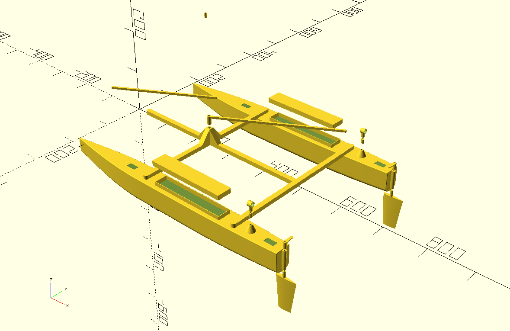

# 建模

## 软件环境

代码是基于python3的，而且依赖于[solidpython](https://github.com/SolidCode/SolidPython)模块，需要安装：
```
pip install solidpython
```
python代码执行后，会生成scad文件，该文件是openscad软件的源码文件，用openscad打开后，可以看到预览，或者渲染模型、导出stl文件。

## 代码用法

双体帆船的建模代码封装在catamaran.py的Catamaran类中。我将结合example.py中的代码解释Catamaran类中各个函数的用法。

example.py利用Catamaran类构建了一艘长600mm的双体帆船，并将所有零部件导出到all.scad中以供预览。总体效果如下：


首先看代码
```
(hull, wall, lid) = Catamaran.hull(600, 50, 60, 1.2, segments)
```
hull()函数用于构建一个船体，示例中长度是600，宽度是50，高度是60，壁厚是1.2，最后一个参数segments用来指定曲面的细腻程度（3D建模中，一个曲面使用很多小三角形拼接，用平面逼近曲面，segments就是指一个曲面的分片数量）。这个函数返回三元组(hull, wall, lid)，即船壳、舱门防水台和舱门盖。
